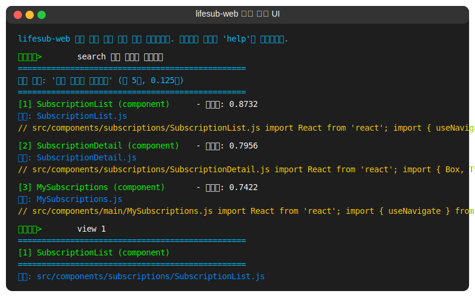

# Backend-Fragmentor - lifesub-web 소스 코드 분석 및 파편화 POC

이 프로젝트는 Backend-Fragmentor 서비스의 POC(Proof of Concept)로, React 기반의 lifesub-web 애플리케이션 소스 코드를 의미 단위로 파편화하고 벡터화하여 효율적인 검색이 가능하도록 구현한 것입니다.

## 개요

이 POC는 Backend-Fragmentor 서비스의 핵심 기능을 검증하기 위한 것으로, 다음 기능을 제공합니다:

- **코드 파싱**: lifesub-web 프로젝트의 React 소스 코드를 파싱하여 AST(Abstract Syntax Tree) 분석
- **의미 단위 파편화**: 컴포넌트, 함수, JSX 요소, API 호출 등을 의미 단위로 분절
- **벡터 임베딩 생성**: 각 코드 파편에 대한 임베딩 벡터 생성
- **벡터 저장소**: Faiss를 활용한 벡터 저장 및 효율적인 유사도 검색
- **대화형 검색 인터페이스**: 코드 파편을 검색하고 탐색할 수 있는 CLI 도구

본 POC는 최종적으로 Backend-Fragmentor 서비스로 발전하여, 레거시 프로젝트의 코드 분석 및 검색 기능을 제공할 예정입니다.

## 파편화 프로세스 다이어그램

아래는 lifesub-web 프로젝트의 소스 코드 파편화 및 벡터화 과정을 보여주는 다이어그램입니다:


## 설치 및 실행

### 요구 사항

- Python 3.9 이상
- 필요한 패키지:
  - esprima==4.0.1
  - sentence-transformers==2.2.2
  - faiss-cpu==1.7.4
  - torch==2.6.0
  - colorama
  - tqdm==4.65.0

### 설치

```bash
# 저장소 클론
git clone https://github.com/your-org/backend-fragmentor.git
cd backend-fragmentor

# 가상환경 설정
python -m venv venv
source venv/bin/activate  # Linux/Mac
# 또는
venv\Scripts\activate     # Windows

# pip 버전 업그레이드 (25.0.1 버전 필요)
pip install --upgrade pip==25.0.1

# 의존성 설치
pip install -r requirements.txt
```

### 가상환경(venv) 활용

생성한 가상환경(venv)은 다음과 같은 용도로 활용됩니다:

- **의존성 관리**: 프로젝트에 필요한 패키지만 설치하여 환경을 깨끗하게 유지
- **패키지 격리**: 다른 Python 프로젝트와의 패키지 버전 충돌 방지
- **Python 버전 관리**: 특정 Python 버전으로 프로젝트 실행 가능
- **재현 가능한 환경**: `requirements.txt`를 통해 동일한 환경을 쉽게 재현
- **배포 준비**: 가상환경을 통해 실제 서비스 배포 시의 환경과 유사하게 테스트

개발 및 실행 시 항상 가상환경을 활성화한 상태에서 진행하는 것이 좋습니다:

```bash
# 가상환경 활성화
source venv/bin/activate  # Linux/Mac
# 또는
venv\Scripts\activate     # Windows

# 가상환경 종료
deactivate
```

### 실행 방법

#### 1. 코드 파편화 및 벡터화

```bash
# 가상환경 활성화 후
# lifesub-web 프로젝트 파편화
python lifesubweb-fragmentor.py --project /path/to/lifesub-web

# 데이터 디렉토리 지정 (기본값: ./data)
python lifesubweb-fragmentor.py --project /path/to/lifesub-web --data-dir ./custom-data-dir
```

#### 2. 코드 검색

```bash
# 가상환경 활성화 후
# 대화형 검색 인터페이스 실행
python search_ui.py

# 데이터 디렉토리 지정
python search_ui.py --data-dir ./custom-data-dir
```

## 검색 쿼리 예시

```bash
# 특정 쿼리로 직접 검색
python lifesubweb-fragmentor.py --project /path/to/lifesub-web --query "구독 서비스 목록 컴포넌트"

# 대화형 검색 모드
python lifesubweb-fragmentor.py --project /path/to/lifesub-web --search

# 필터링을 적용한 검색 (대화형 UI 내에서)
코드검색> search 구독 컴포넌트 --type=component
코드검색> search API 호출 --type=api_call
```

## 검색 UI 스크린샷

대화형 코드 검색 인터페이스:



## 사용 예시

다음은 실제 실행 과정과 사용 예시입니다:

```bash
# 1. 가상환경 활성화
source venv/bin/activate  # Linux/Mac
# 또는
venv\Scripts\activate     # Windows

# 2. 파편화 및 벡터화 실행
python lifesubweb-fragmentor.py --project ../lifesub-web --data-dir ./data

================================================
 lifesub-web 프로젝트 파편화 및 벡터화 시작: ../lifesub-web
================================================

[1/4] 프로젝트 파싱 중...
lifesub-web 프로젝트 파싱 중: ../lifesub-web
처리 중... 10개 파일 완료
처리 중... 20개 파일 완료
처리 중... 30개 파일 완료
  - 파싱된 파일: 31개
  - 감지된 컴포넌트: 24개
  - 파일 확장자 분포: {'.js': 28, '.jsx': 3}

[2/4] 코드 파편화 중...
  - 생성된 파편: 112개
  - 파편 타입 분포: {'component': 24, 'function': 43, 'jsx_element': 21, 'import_block': 14, 'api_call': 8, 'routing': 2}
  - 컴포넌트 타입 분포: {'functional': 22, 'arrow_function': 2}

[3/4] 임베딩 생성 중...
  - 모델: all-MiniLM-L6-v2
  - 벡터 차원: 384
100%|██████████| 4/4 [00:02<00:00,  1.47it/s]
  - 생성된 임베딩: 112개

[4/4] 벡터 저장소에 저장 중...
112개 벡터 추가 완료 (현재 총 112개)

================================================
 처리 완료 (소요 시간: 12.34초)
================================================
  - 저장된 벡터: 112개
  - 벡터 차원: 384
  - 인덱스 타입: Cosine
  - 파편 타입 분포: {'component': 24, 'function': 43, 'jsx_element': 21, 'import_block': 14, 'api_call': 8, 'routing': 2}
  - 처리된 파일 수: 31

# 3. 대화형 검색 UI 실행
python search_ui.py --data-dir ./data
```

## 파편화 프로세스 상세

### 1. 코드 파싱
- JSX/JS 파일을 파싱하여 AST 생성
- 컴포넌트, 훅, 함수 등의 의미 단위 식별
- 파일 메타데이터 수집
- lifesub-web 특화 정보(카테고리, 목적) 추출

### 2. 코드 파편화
- 다양한 단위로 코드 파편화:
  - 컴포넌트 (함수형, 클래스, 메모)
  - 커스텀 훅
  - 내부 함수
  - JSX 요소
  - API 호출
  - MUI 컴포넌트
  - 라우팅 관련 코드
  - Import 블록
  - 상태 관리 로직

### 3. 임베딩 생성
- SentenceTransformer 모델을 사용하여 코드 파편의 벡터 임베딩 생성
- 코드 내용과 함께 메타데이터 컨텍스트를 포함한 임베딩
- lifesub-web 특화 키워드 및 개념 포함
- 배치 처리 및 캐싱을 통한 성능 최적화

### 4. 벡터 저장
- Faiss를 이용한 벡터 인덱싱
- 코사인 유사도를 통한 검색
- 메타데이터와 매핑 정보 저장
- 필터링 기능 지원

### 5. 검색 인터페이스
- 대화형 CLI 검색 도구
- 컬러 하이라이팅된 결과 출력
- 파편 상세 보기 및 유사 파편 탐색
- 파일별, 타입별 필터링 옵션

## 프로젝트 구조

```
backend-fragmentor/
├── lifesubweb-fragmentor.py     # POC 메인 실행 스크립트
├── search_ui.py                 # 검색 UI
├── requirements.txt             # 의존성 패키지
├── README.md                    # 프로젝트 개요
├── Fragmentor-POC.md            # POC 설명 문서
├── fragmentor_process.mmd       # 프로세스 다이어그램
├── search_ui_example.svg        # 예시 이미지
├── venv/                        # 가상환경 디렉토리
└── app/                         # 핵심 모듈
    ├── parser/                  # 코드 파서
    │   └── jsx_parser.py        # 향상된 JSX 파서
    ├── fragmenter/              # 파편화 모듈
    │   └── fragmenter.py        # 파편화 엔진
    ├── embedding/               # 임베딩 모듈
    │   └── embedder.py          # 임베딩 생성기
    ├── storage/                 # 벡터 저장소
    │   └── faiss_store.py       # Faiss 벡터 저장소
    └── main.py                  # 애플리케이션 진입점
    └── __init__.py              # 버전 정보 제공
```

## 확장 및 개선 방향

### 향후 개발 방향
1. **Backend-Fragmentor 서비스화** - POC에서 실제 서비스로 전환
2. **FastAPI 기반 API 서비스** - 검색 및 관리 API 개발
3. **다중 언어 지원** - Java, Python, TypeScript 등 추가 언어 지원
4. **벡터 DB 고도화** - 더 효율적인 벡터 검색 및 저장 구현
5. **웹 인터페이스** - 웹 기반 코드 검색 및 탐색 UI 개발

### 파편화 성능 개선
- 임베딩 생성 병렬 처리 최적화
- 증분 업데이트 지원 (변경된 파일만 재처리)
- 언어별 특화 파서 통합

### 검색 기능 확장
- 자연어 코드 변환 검색
- 유사 코드 클러스터링
- 코드 관계 시각화
- 복잡한 쿼리 구문 지원

## 의존성 관리

프로젝트의 의존성은 가상환경(venv)과 `requirements.txt`를 통해 관리됩니다:

```bash
# 현재 설치된 패키지 확인
pip list

# 특정 pip 버전 설치 (프로젝트에는 25.0.1 버전 필요)
pip install --upgrade pip==25.0.1

# 의존성 업데이트
pip install --upgrade <package_name>

# 특정 버전 패키지 설치
pip install <package_name>==<version>

# 현재 설치된 패키지를 requirements.txt로 저장
pip freeze > requirements.txt

# 새로운 가상환경 생성 시 의존성 설치
python -m venv new_venv
source new_venv/bin/activate  # Linux/Mac
pip install --upgrade pip==25.0.1  # 먼저 pip 버전 업그레이드
pip install -r requirements.txt
```

### 주요 패키지 버전 요구사항

프로젝트에 필요한 특정 버전의 주요 패키지들:

- pip==25.0.1
- sentence-transformers==2.2.2
- faiss-cpu==1.7.4
- torch==2.0.1
- esprima==4.0.1
- tqdm==4.65.0
- colorama (최신 버전)

이러한 버전 요구사항은 호환성 문제를 방지하고 일관된 환경을 유지하기 위해 중요합니다.


## 주의사항

- 현재 이 코드는 POC 단계로, 프로덕션 환경에서의 사용은 권장하지 않습니다.
- 데이터 디렉토리에 생성되는 인덱스 및 캐시 파일은 상당한 용량을 차지할 수 있으니 `.gitignore`에 추가하여 관리하세요.
- SentenceTransformer와 Faiss를 사용하므로 충분한 메모리가 필요합니다.
- 가상환경 디렉토리(venv/)는 Git에 포함시키지 말고 `.gitignore`에 추가하세요.
- 특정 버전의 pip(25.0.1)이 필요하므로 가상환경 활성화 후 첫 번째로 pip를 업그레이드하세요.
- 환경 구성 시 발생하는 dependency 충돌 문제는 `pip install --no-deps <package>` 옵션을 사용하여 해결할 수 있습니다.

## 라이선스

이 프로젝트는 내부 사용 목적으로 개발되었습니다.